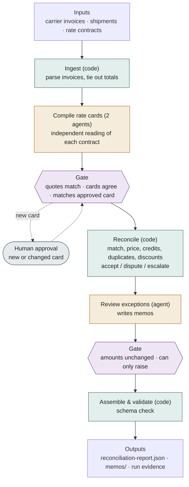

# Freight Reconciliation Architecture

```mermaid
flowchart TD
    IN["Inputs<br/>carrier invoices · shipments · rate contracts"]
    ING["Ingest (code)<br/>parse invoices, tie out totals"]
    RC["Compile rate cards (2 agents)<br/>independent reading of each contract"]
    G1{{"Gate<br/>quotes match · cards agree · matches approved card"}}
    H(["Human approval<br/>new or changed card"])
    REC["Reconcile (code)<br/>match, price, credits, duplicates, discounts<br/>accept / dispute / escalate"]
    REV["Review exceptions (agent)<br/>writes memos"]
    G2{{"Gate<br/>amounts unchanged · can only raise"}}
    ASM["Assemble & validate (code)<br/>schema check"]
    OUT["Outputs<br/>reconciliation-report.json · memos/ · run evidence"]

    IN --> ING --> RC --> G1 --> REC --> REV --> G2 --> ASM --> OUT
    G1 -. "new card" .-> H -.-> G1

    classDef code fill:#e3efec,stroke:#2f6f66,color:#1a2422
    classDef agent fill:#f6ecdc,stroke:#a86a12,color:#1a2422
    classDef gate fill:#efe6f5,stroke:#6d3f8f,color:#1a2422
    classDef human fill:#e7eaed,stroke:#4a5560,color:#1a2422
    class ING,REC,ASM code
    class RC,REV agent
    class G1,G2 gate
    class H human
```

HTML version: [architecture.html](architecture.html)
