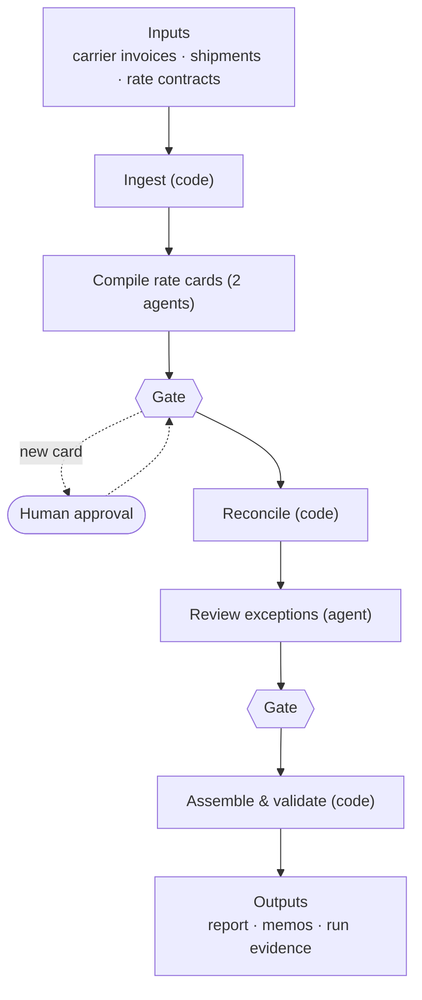

# Freight Invoice Reconciliation

Carriers send us invoices. Before we pay them, we need to know if each line is right.

This project checks every carrier invoice line against our shipment records and the carrier's contract. For each line it decides one of three things:

- **Accept**: the charge is correct.
- **Dispute**: the charge is wrong, and we know by how much.
- **Escalate**: we can't be sure, so a person should look at it.

The output is a report (`reconciliation-report.json`) and a short memo for every disputed or escalated item (`memos/`).

## How it works

Code does all the maths. AI agents only do two things: read the contracts into structured rate cards, and review the exceptions and write the memos. A code check sits between every step, so nothing an agent writes is used without being verified. A person approves each rate card once, before it is used.



Want more detail?

- **Architecture diagram**: [Artifacts/architecture.md](Artifacts/architecture.md), or open [Artifacts/architecture.html](Artifacts/architecture.html) in a browser ([online version](https://claude.ai/artifact/LW8uAV4JCCqD7ukvsikzVL))
- **Why we built it this way**: open [Artifacts/tradeoffs.html](Artifacts/tradeoffs.html) in a browser ([online version](https://claude.ai/artifact/XHtmUMXCxEuXp6fdBjGYUN))
- **Full design notes**: [DESIGN.md](DESIGN.md)

## Getting started

### What you need

- Python 3
- `git`, `tmux` and `jq`
- [Claude Code](https://claude.com/claude-code) (the `claude` command), signed in

On a Mac you can install the tools with:

```bash
brew install tmux jq
```

### 1. Set up

Run this once. It creates a local Python environment and installs what the project needs.

```bash
orchestrator/setup.sh
```

### 2. Run the tests

This checks the part that does the maths. Everything should pass before you run a reconciliation.

```bash
scripts/test.sh
```

### 3. Run the reconciliation

Start Claude Code from the project folder:

```bash
claude
```

Then ask it:

```
reconcile the freight invoices
```

Claude will run the whole flow and start the AI agents in `tmux` windows. On a machine that has never run it before, Claude Code may ask you to accept a permissions prompt once.

When it finishes, you will find:

- `reconciliation-report.json`: the result for every invoice line
- `memos/`: one memo for each disputed or escalated item
- `run-manifest.json`: details of the run

If a contract has changed since its rate card was approved, the run stops and asks a person to review the new rate card before going on.

### Compare two runs

The same data should always give the same result. To check two runs against each other:

```bash
orchestrator/.venv/bin/python -m recon diff-runs <first run>/out <second run>/out
```

## Project layout

| Folder | What's in it |
| --- | --- |
| `data/` | Sample invoices, shipments and contracts |
| `recon/` | The reconciliation code |
| `rate-cards/approved/` | Rate cards a person has approved |
| `factory/flows/` | The steps of the run and the agent prompts |
| `orchestrator/` | Tools that run the flow and the agents |
| `tests/` | Unit tests |
| `Artifacts/` | Architecture and tradeoff pages |
